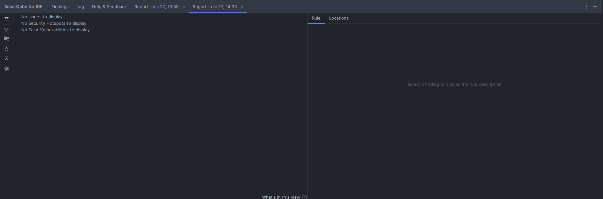

# Sistema de Votación

## Descripción del Proyecto

Este proyecto es una API REST desarrollada con Spring Boot que simula un sistema de votación simple. Permite gestionar partidos políticos, candidatos y registrar votos. La aplicación utiliza una base de datos en memoria H2 para facilitar la ejecución y prueba sin necesidad de configuración adicional.


## Instrucciones de Ejecución

Siga estos pasos para ejecutar la aplicación en su entorno local.


### Prerrequisitos

-   Java 17 o superior.
-   Apache Maven.


### Pasos para la Ejecución

1.  **Clonar el repositorio:**
    ```bash
    git clone <URL_DEL_REPOSITORIO>
    cd sistemaDeVotacion
    ```

2.  **Ejecutar la aplicación:**
    Puede iniciar la aplicación utilizando el wrapper de Maven incluido.

    En Linux/macOS:
    ```bash
    ./mvnw spring-boot:run
    ```

    En Windows:
    ```bash
    ./mvnw.cmd spring-boot:run
    ```

    La aplicación se iniciará en `http://localhost:8080`.


### Acceso a Herramientas

-   **Swagger UI (Documentación de la API):**
    Una vez que la aplicación esté en funcionamiento, puede acceder a la documentación interactiva de la API a través de Swagger UI en la siguiente URL:
    [http://localhost:8080/swagger-ui/index.html](http://localhost:8080/swagger-ui/index.html)

-   **Consola H2 (Base de Datos):**
    Puede acceder a la consola de la base de datos en memoria H2 para ver los datos o ejecutar consultas.
    -   **URL:** [http://localhost:8080/h2-console](http://localhost:8080/h2-console)
    -   **JDBC URL:** `jdbc:h2:mem:testdb`
    -   **Username:** `sa`
    -   **Password:** (dejar en blanco)


## Datos de Prueba

Al iniciar, la aplicación carga automáticamente los siguientes datos de prueba en la base de datos:


### Partidos Políticos

| Nombre           | Acrónimo |
| ---------------- | -------- |
| Partido Rojo     | PR       |
| Partido Amarillo | PA       |
| Partido Verde    | PV       |


### Candidatos

| Nombre Completo        | Partido Político   |
| ---------------------- | ------------------ |
| Gero Arias             | Partido Amarillo   |
| Tomas Mazza            | Partido Rojo       |
| Martin Perez Disalvo   | Partido Verde      |


## Análisis de SonarLint

A continuación se adjunta una captura del análisis estático de código realizado con SonarLint.

*(Por favor, inserte aquí la captura de pantalla del análisis de SonarLint)*

## SonarLint Análisis
